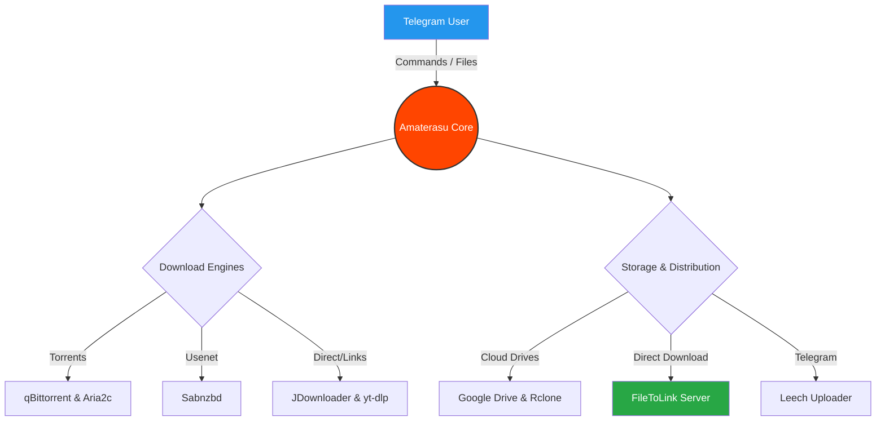

<div align="center">

# ☀️ A M A T E R A S U ☀️

```text
      █████╗ ███╗   ███╗███████╗████████╗███████╗██████╗  █████╗ ███████╗██╗   ██╗
     ██╔══██╗████╗ ████║██╔════╝╚══██╔══╝██╔════╝██╔══██╗██╔══██╗██╔════╝██║   ██║
     ███████║██╔████╔██║█████╗     ██║   █████╗  ██████╔╝███████║███████╗██║   ██║
     ██╔══██║██║╚██╔╝██║██╔══╝     ██║   ██╔══╝  ██╔══██╗██╔══██║╚════██║██║   ██║
     ██║  ██║██║ ╚═╝ ██║███████╗   ██║   ███████╗██║  ██║██║  ██║███████║╚██████╔╝
     ╚═╝  ╚═╝╚═╝     ╚═╝╚══════╝   ╚═╝   ╚══════╝╚═╝  ╚═╝╚═╝  ╚═╝╚══════╝ ╚═════╝ 
```

**The Absolute Pinnacle of Telegram Mirroring and Leeching**

<p align="center">
  <a href="#"></a>
  <a href="#"></a>
  <a href="#"></a>
  <br>
  <a href="#"></a>
  <a href="#"></a>
</p>

[**Telegram Channel**](#) • [**Support Group**](#) • [**Documentation**](#)

</div>

---

## 🔮 The Core Concept

**Amaterasu** is not just another Telegram bot—it is a meticulously engineered cloud orchestration system. Designed for power users, it converges top-tier download engines (qBittorrent, Aria2, Sabnzbd, JDownloader) and cloud drives (GDrive, Mega, Rclone) into one cohesive experience entirely controllable from your Telegram DMs.

> [!IMPORTANT]
> **Amaterasu** introduces the **FileToLink Streaming Architecture**, transforming your bot into a blazing-fast media server that delivers byte-seekable stream links straight to VLC, MX Player, or any modern browser.

---

## 💎 Elite Feature Set

<table align="center">
  <tr>
    <td align="center" width="50%">
      <h3>🌐 FileToLink Gateway</h3>
      <p>Instantly spawn HTTP 206 streamable links. Features automated <strong>Multi-Token Load Balancing</strong> to evade FloodWait penalties and keep latency at zero.</p>
    </td>
    <td align="center" width="50%">
      <h3>🎭 Smart Rename Engine</h3>
      <p>Tired of chaotic filenames? Toggle <code>/rename</code> mode to seamlessly intercept any leech task or private PM. Type your new name, and Amaterasu handles the rest.</p>
    </td>
  </tr>
  <tr>
    <td align="center" width="50%">
      <h3>🌩️ Limitless Cloud Integrations</h3>
      <p>Natively pulls from Torrents, Direct Links, Usenet, and Mega. Effortlessly dumps to Google Drive, Rclone Remotes, or back to Telegram without breaking a sweat.</p>
    </td>
    <td align="center" width="50%">
      <h3>🛡️ Bulletproof Resilience</h3>
      <p>Built with enterprise-grade queuing, automated retries, dynamic polling intervals, and MongoDB persistence so your configurations and downloads never falter.</p>
    </td>
  </tr>
</table>

---

## 🧬 Architectural Blueprint



---

## 🚀 Ignition & Deployment

Amaterasu supports zero-friction deployment. Forget manual dependency nightmares—use our polished Docker integration.

### 💻 Containerized VPS Setup (Docker Compose)

> [!TIP]  
> We strongly recommend **Docker Compose** to handle isolated networks and automated restarts flawlessly.

```shell
# 1. Bring down the repository
$ git clone https://github.com/its-niloy/Amaterasu.git && cd Amaterasu

# 2. Architect your configuration
$ cp config_sample.py config.py
$ nano config.py  # Input your Telegram API & Tokens

# 3. Ignite the core (in detached mode)
$ sudo docker-compose up --build -d

# 4. Monitor the pulse
$ sudo docker-compose logs -f
```

<details>
  <summary><b>🛠️ Click here for Advanced Maintenance Commands</b></summary>
  <br>
  
  * **Halt System:** `sudo docker-compose stop`
  * **Revive System:** `sudo docker-compose start`
  * **Purge Orphaned Containers:** `sudo docker container prune`
  * **Nuke Stale Images:** `sudo docker image prune -a`

</details>

### ☁️ Cloud Platforms (PaaS)

Amaterasu’s lightweight, modular skeleton makes it perfect for Heroku, Railway, or Render. Simply fork the repository, connect your PaaS, inject the environment variables matching `config_sample.py`, and spin up your container!

---

## ⚙️ Prerequisites for the Journey

Before launching Amaterasu, assemble your artifacts:

1. **Telegram API ID & Hash**: Forged at [my.telegram.org](https://my.telegram.org).
2. **Bot Token**: Summoned from [@BotFather](https://t.me/BotFather).
3. **Database URI**: A MongoDB cluster to persist your sacred configurations and queues.
4. **Hardware**: A server with at least `1GB RAM` is heavily recommended for unpacking heavy media.

---

<div align="center">

**[ ☀️ Awaken the Sun. Deploy Amaterasu Today. ☀️ ]**

*If this engine powers your workflow, drop a ⭐ to show your support.*

</div>
